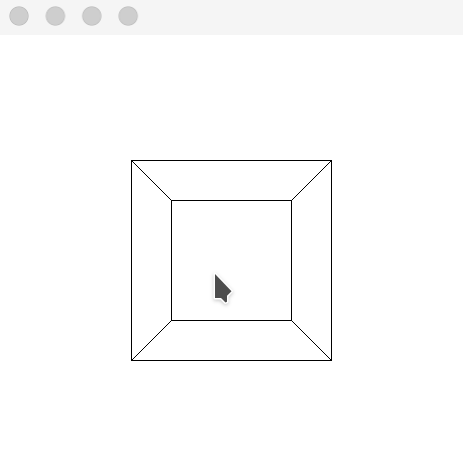

# Cube



[X11 Proto](https://x.org/releases/X11R7.7/doc/xproto/x11protocol.html)
[programmers-guide-to-homogeneous-coordinates](https://hackernoon.com/programmers-guide-to-homogeneous-coordinates-73cbfd2bcc65)

## todo
- [x] 渲染
- [x] 靠近远离
- [x] 平移
- [ ] 旋转

## Requirement
```
zypper install libxcb-devel
```