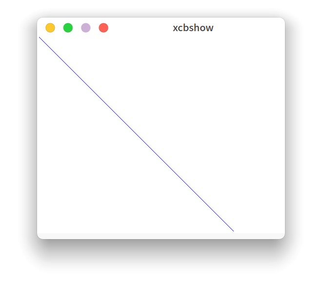
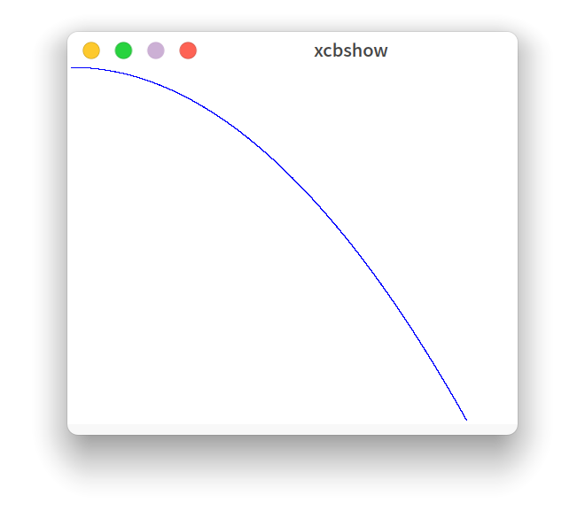

# Plotter

## Todo
- [ ] 光栅化

## Requirement
```
zypper install libxcb-devel
```

## Demo



## Reference
- [X11 Proto](https://x.org/releases/X11R7.7/doc/xproto/x11protocol.html)
- [programmers-guide-to-homogeneous-coordinates](https://hackernoon.com/programmers-guide-to-homogeneous-coordinates-73cbfd2bcc65)
